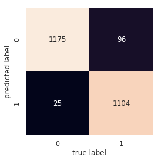

# Classify-the-Lunar-Rock-HackerEarth-Data-Science-Competition
● Here I am classifying between two types of Lunar rocks i.e Small and Large.  
● Here I Have used google colab for training and inference purposes.  
● The Link to the Competition is https://www.hackerearth.com/challenges/competitive/lunar-rock-hackerearth-data-science-competition/  
● My Rank in this Competition was 51. 
● The link to the dataset is https://drive.google.com/drive/folders/1kT5GDYy-FoD5NQWTgD3ku-iFuiP7OqTS?usp=sharing .  
● Here I have used Transfer Learning by using ResNet50 Architecture.  
● I have used Keras for Image Classification.  
● I trained the network for 7 epochs and I was getting validation accuracy of 95% and validation loss of 0.7998.  
● Then I made the Confusion matrix for images in val.  
 
● The link to the trained model is given below - 
    https://drive.google.com/file/d/12VfsmFoRs_PPIQGponvFEyvSkgHs9Kqs/view?usp=sharing  
● You can refer the jupyter notebook for source code.  

